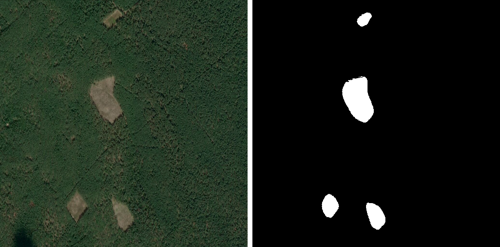
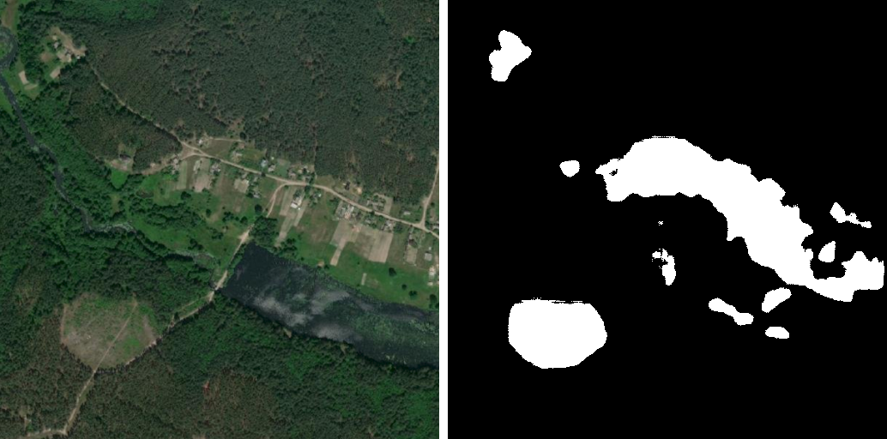

# deforestation-semantic-segmentation

### Introduction
In this project, you get a black and white segmentation mask of a satellite image with deforestations detected on it. It was written using the Tensorflow and Keras libraries.

### Dataset
The data set used for network training was created on Ukraine territory by using Google Earth, Google Maps, ArcGIS Online to create set of color satellite images and VGG Image Annotator and dh_segment for creating masks. The dataset consists of 325 images taken in Ukraine different areas. The data set contains images of size 1024x768 pixels and 600x600 pixels. Each image has a black and white mask of the corresponding size on which deforestations are marked with polygons.

### Model
U-Net is a convolutional neural network for fast and accurate image segmentation, one of the most effective architectures. She was created in 2015 for the segmentation of biomedical images for which characteristic constant angle. This architecture allows you to work with a small number of images for learning, as it has a relatively small the number of parameters that can be configured.

### Result
Here is an example of a predicted mask for input image from a trained network:

 

### Problems
Presence of different objects in the images reduces the quality recognition. This is because images with such objects in training set is not enough to obtain high-quality recognition on such pictures. When expanding the training set, including it various images with the presence of foreign objects and cuttings, quality recognition will increase.

 